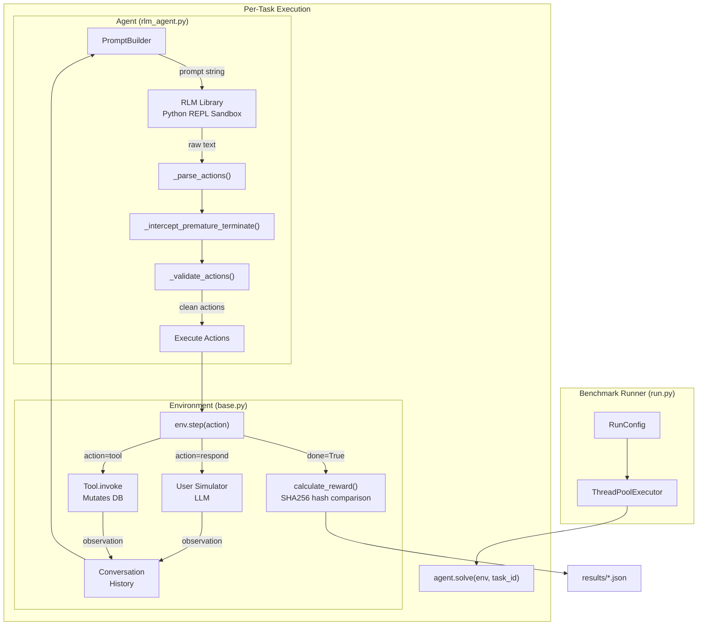
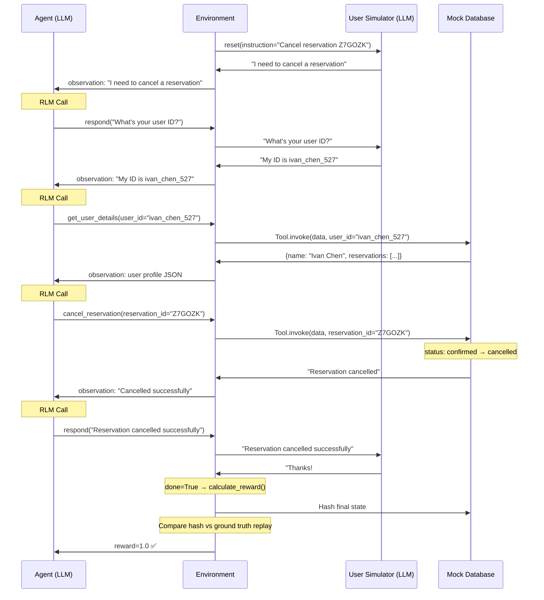
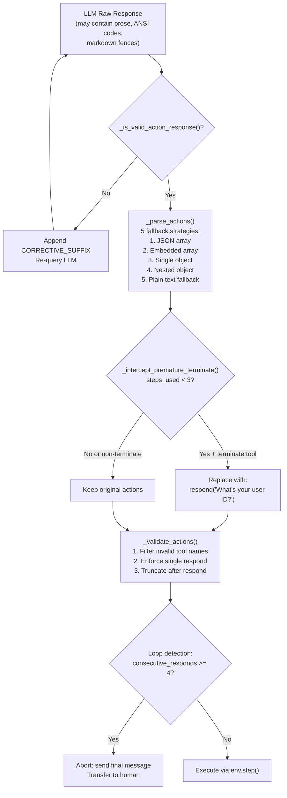
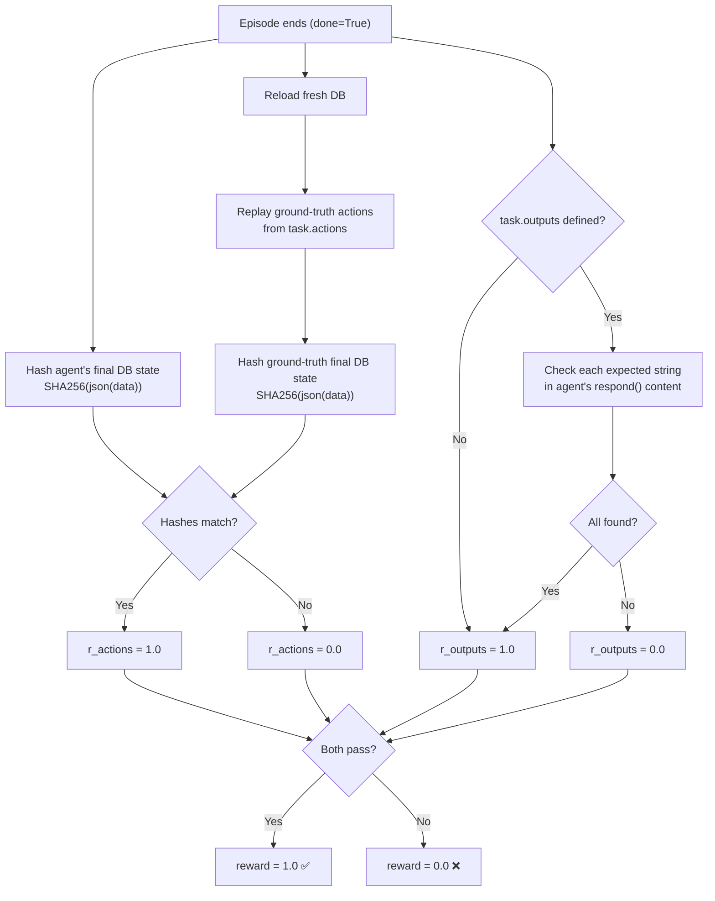

# RLM Agent Architecture for tau-bench

## 1. System Overview

tau-bench is a benchmark that evaluates LLM agents on real-world customer service tasks. It creates a simulated conversation between three actors:

```
┌──────────────────┐     ┌──────────────────┐     ┌──────────────────┐
│   User Simulator │◄───►│   Environment    │◄───►│   Agent (LLM)    │
│   (LLM-based)    │     │  (State + Tools) │     │  (Qwen3-32B)     │
└──────────────────┘     └──────────────────┘     └──────────────────┘
```

- **Agent**: An LLM (e.g., Qwen3-32B) that acts as a customer service representative. It reads policy, uses API tools, and responds to the customer.
- **User Simulator**: A separate LLM (e.g., GPT-4o or Qwen3-32B) that role-plays as a customer following a hidden task instruction.
- **Environment**: Manages a mock database, dispatches tool calls, routes messages between agent and user, and calculates reward.

The benchmark measures whether the agent can accomplish the customer's goal correctly — not just in conversation, but by making the right database mutations and producing the right output values.

---

## 2. The Three Actors in Detail

### 2.1 Agent (RLM Agent)

Our agent uses the **RLM (Recursive Language Model)** library, which wraps an LLM in a Python REPL sandbox. Instead of direct API chat, the model operates inside a sandboxed code environment:

```
┌─────────────────────────────────────────────────────────┐
│                    RLM REPL Sandbox                      │
│                                                          │
│  Variables:                                              │
│    context = "# YOUR TASK\nYou are a customer service..."│
│                                                          │
│  Model writes:                                           │
│    ```repl                                               │
│    print(context)      ← reads the full prompt           │
│    ```                                                   │
│                                                          │
│  Model sees output, then writes:                         │
│    FINAL([{"name":"get_user_details",                    │
│            "kwargs":{"user_id":"john_doe_123"}}])        │
│                                                          │
│  RLM extracts the JSON array from FINAL()               │
│  and returns it to our agent code                        │
│                                                          │
└─────────────────────────────────────────────────────────┘
```

**Why RLM instead of direct chat?**
- RLM provides a structured execution environment
- The model must explicitly read context before acting (prevents hallucination)
- FINAL() enforces structured output (JSON action arrays)
- The REPL can be extended with tools for complex reasoning

### 2.2 User Simulator

The user simulator is a separate LLM instance that receives a hidden instruction (the "task") and role-plays as a customer:

```
Hidden instruction (not visible to agent):
  "You want to cancel reservation Z7GOZK. Your user ID is
   ivan_chen_527. You want a full refund to your credit card."

User's behavior:
  Turn 1: "Hi, I need to cancel a reservation."
  Turn 3: "My user ID is ivan_chen_527."
  Turn 5: "Yes, reservation Z7GOZK."
  Turn 7: "Great, thanks!" → ###STOP###
```

Key rules enforced on the user simulator:
- Reveals information **gradually** (doesn't dump everything at once)
- Cannot hallucinate data outside the instruction
- Says `###STOP###` when satisfied (or frustrated), ending the episode

### 2.3 Environment

The environment is the orchestration layer:

```
┌─────────────────────────────────────────────────────┐
│                    Environment                       │
│                                                      │
│  ┌──────────┐  ┌──────────────┐  ┌──────────────┐  │
│  │ Mock DB  │  │  Tool Suite  │  │ Task + Ground │  │
│  │ (dict)   │  │ (14 airline  │  │  Truth Actions│  │
│  │          │  │  or 16 retail│  │              │   │
│  └──────────┘  └──────────────┘  └──────────────┘  │
│                                                      │
│  Key Methods:                                        │
│    reset(task_id) → load fresh DB, init user sim     │
│    step(action)   → execute tool or route message    │
│    calculate_reward() → compare DB hash vs GT        │
│                                                      │
└─────────────────────────────────────────────────────┘
```

The mock database is a Python dictionary containing users, reservations, flights, payments, etc. Tools mutate this dict directly. At the end of the episode, the entire dict is hashed to check correctness.

---

## 3. Turn-Based Conversation Flow

This is the core loop. Each "turn" involves the agent producing an action, the environment executing it, and returning an observation.

```
┌────────┐          ┌─────────────┐          ┌──────────────┐
│ Agent  │          │ Environment │          │ User Sim     │
│ (LLM)  │          │ (State+Tools│          │ (LLM)        │
└───┬────┘          └──────┬──────┘          └──────┬───────┘
    │                      │                        │
    │  ◄── env.reset() ────┤   user.reset()  ──────►│
    │      "Hi, I need     │   (hidden task)        │
    │       help..."       │◄── "Hi, I need..." ────┤
    │                      │                        │
    ├── TURN 1 ───────────►│                        │
    │  respond("What's     │                        │
    │   your user ID?")    ├── user.step(msg) ─────►│
    │                      │◄── "My ID is xyz" ─────┤
    │  ◄── obs: "My ID     │                        │
    │       is xyz"        │                        │
    │                      │                        │
    ├── TURN 2 ───────────►│                        │
    │  get_user_details    │                        │
    │  (user_id="xyz")     ├── Tool.invoke(data)    │
    │                      │   (mutates DB)         │
    │  ◄── obs: "{name:    │                        │
    │       John, ...}"    │                        │
    │                      │                        │
    ├── TURN 3 ───────────►│                        │
    │  get_reservation     │                        │
    │  (reservation_id=    ├── Tool.invoke(data)    │
    │   "Z7GOZK")         │   (reads DB)           │
    │  ◄── obs: "{flight:  │                        │
    │       HAT136, ...}"  │                        │
    │                      │                        │
    ├── TURN 4 ───────────►│                        │
    │  cancel_reservation  │                        │
    │  (reservation_id=    ├── Tool.invoke(data)    │
    │   "Z7GOZK")         │   (MUTATES DB!)        │
    │  ◄── obs: "Cancelled │                        │
    │       successfully"  │                        │
    │                      │                        │
    ├── TURN 5 ───────────►│                        │
    │  respond("Your       │                        │
    │   reservation has    ├── user.step(msg) ─────►│
    │   been cancelled.")  │◄── "Thanks! ###STOP###"┤
    │                      │                        │
    │  ◄── done=True       │                        │
    │      reward=1.0      ├── calculate_reward()   │
    │                      │   hash(DB) == hash(GT) │
    │                      │   ✅ Match!            │
    │                      │                        │
    ▼                      ▼                        ▼
```

### Action Types

The agent can produce two types of actions each turn:

| Action Type | What Happens | Example |
|-------------|--------------|---------|
| **Tool Call** | Environment executes the tool against the mock DB | `get_user_details(user_id="xyz")` |
| **Respond** | Message is routed to the user simulator, which generates a reply | `respond(content="What's your user ID?")` |

### Episode Termination

An episode ends when any of these occur:
1. User simulator says `###STOP###` (satisfied or gave up)
2. Agent calls a **terminate tool** (`transfer_to_human_agents`) — sets `done=True` immediately
3. Agent reaches **max steps** (30)
4. Our loop detection triggers (4 consecutive respond-only turns)

---

## 4. Reward Calculation

This is the most critical part of the architecture. The reward determines if the agent "passed" or "failed" a task.

```
                        REWARD CALCULATION
                    ┌─────────────────────┐
                    │  Two-Phase Check    │
                    └─────────┬───────────┘
                              │
              ┌───────────────┴───────────────┐
              ▼                               ▼
    ┌─────────────────┐             ┌─────────────────┐
    │ Phase 1: Actions │             │ Phase 2: Outputs │
    │ (DB State Check) │             │ (Text Check)     │
    └────────┬────────┘             └────────┬────────┘
             │                               │
    ┌────────▼────────┐             ┌────────▼────────┐
    │ 1. Hash agent's │             │ 1. Collect all   │
    │    final DB     │             │    respond()     │
    │    state        │             │    content       │
    │                 │             │                  │
    │ 2. Reload fresh │             │ 2. Check each    │
    │    DB           │             │    expected      │
    │                 │             │    output exists │
    │ 3. Replay       │             │    (case-        │
    │    ground-truth │             │    insensitive)  │
    │    actions      │             │                  │
    │                 │             │ 3. All found?    │
    │ 4. Hash GT      │             │    → r_out = 1.0 │
    │    final DB     │             │    Missing any?  │
    │                 │             │    → r_out = 0.0 │
    │ 5. Compare:     │             │                  │
    │    SHA256 match? │             │                  │
    │    → r_act = 1.0│             │                  │
    │    Mismatch?    │             │                  │
    │    → r_act = 0.0│             │                  │
    └────────┬────────┘             └────────┬────────┘
             │                               │
             └───────────┬───────────────────┘
                         ▼
              ┌─────────────────────┐
              │  Final Reward       │
              │                     │
              │  Both pass → 1.0    │
              │  Either fails → 0.0 │
              └─────────────────────┘
```

### Why SHA256 Hashing?

The benchmark doesn't check "did you call the right function with the right args." It checks "is the database in the correct final state?" This means:
- Calling `cancel_reservation` correctly but then calling `send_certificate` (adding an extra payment method) → **different hash → reward = 0**
- Using `flight_type: "one way"` instead of `"one_way"` → **different DB state → reward = 0**
- Any extra or missing mutation → **reward = 0**

This is extremely strict but realistic — in production, the DB state is what matters.

---

## 5. RLM Agent Architecture (Our Implementation)

### 5.1 Component Overview

```
┌──────────────────────────────────────────────────────────────────┐
│                        RLMAgent                                  │
│                                                                  │
│  ┌───────────────┐    ┌──────────────────┐    ┌──────────────┐  │
│  │ PromptBuilder │    │   RLM Library    │    │  Action       │  │
│  │               │    │   (REPL Sandbox) │    │  Pipeline     │  │
│  │ - wiki        │    │                  │    │              │   │
│  │ - tools desc  │    │ - Python REPL    │    │ 1. parse     │  │
│  │ - conv history│    │ - context var    │    │ 2. intercept │  │
│  │ - instructions│    │ - FINAL() hook   │    │ 3. validate  │  │
│  │ - param rules │    │ - max_depth=1    │    │              │   │
│  └───────┬───────┘    └────────┬─────────┘    └──────┬───────┘  │
│          │                     │                      │          │
│          ▼                     ▼                      ▼          │
│  ┌──────────────────────────────────────────────────────────┐   │
│  │                      solve() Loop                        │   │
│  │                                                          │   │
│  │  prompt = PromptBuilder.build_prompt(history)            │   │
│  │  result = rlm.completion(prompt, root_prompt=ROOT)       │   │
│  │  actions = _parse_actions(result)                        │   │
│  │  actions = _intercept_premature_terminate(actions)       │   │
│  │  actions = _validate_actions(actions)                    │   │
│  │  for action in actions:                                  │   │
│  │      env_response = env.step(action)                     │   │
│  │      update conversation_history                         │   │
│  │                                                          │   │
│  └──────────────────────────────────────────────────────────┘   │
│                                                                  │
└──────────────────────────────────────────────────────────────────┘
```

### 5.2 The Prompt (What the Agent Sees)

Every turn, the PromptBuilder constructs a single prompt string:

```
┌─────────────────────────────────────────────────────────┐
│                    PROMPT STRUCTURE                       │
├─────────────────────────────────────────────────────────┤
│                                                          │
│  # YOUR TASK                                             │
│  You are a customer service agent...                     │
│                                                          │
│  # Policy and Domain Knowledge                           │
│  [Full airline/retail wiki — policies, procedures,       │
│   pricing, rules, etc.]                                  │
│                                                          │
│  # Available Tools                                       │
│  - get_user_details: Look up user by user_id             │
│      - user_id (string, required): ...                   │
│  - book_reservation: Book a new reservation              │
│      - user_id (string, required): ...                   │
│      - flights (array, required): ...                    │
│  - cancel_reservation: Cancel existing reservation       │
│  - transfer_to_human_agents: LAST RESORT ONLY...         │
│  [... 14 tools total for airline]                        │
│                                                          │
│  # Conversation History                                  │
│  [customer]: Hi, I need to book a flight to Seattle.     │
│  [agent]: Could you provide your user ID?                │
│  [customer]: It's john_doe_123.                          │
│  [agent]: Tool call: get_user_details(...)               │
│  [tool_result]: {"name": "John Doe", ...}                │
│                                                          │
│  # Instructions                                          │
│  ## Output Format                                        │
│  ## Action Rules                                         │
│  ## Parameter Rules                                      │
│  ## Critical Prohibitions                                │
│                                                          │
│  (+ first-turn guidance if conversation just started)    │
│                                                          │
└─────────────────────────────────────────────────────────┘
```

### 5.3 Action Pipeline (Post-Processing)

After the LLM generates a response, it goes through a 3-stage pipeline before execution:

```
     LLM Response (raw text)
            │
            ▼
  ┌─────────────────────┐
  │  1. _parse_actions() │    Extracts JSON actions from free-form text.
  │                      │    5 fallback strategies (array → embedded →
  │                      │    single object → nested → plain text).
  └──────────┬──────────┘
             │
             ▼
  ┌──────────────────────────────┐
  │  2. _intercept_premature_    │    If steps_used < 3, replaces any
  │     terminate()              │    terminate tool (transfer_to_human_
  │                              │    agents) with "ask for user ID"
  │                              │    response. Hard guard.
  └──────────┬───────────────────┘
             │
             ▼
  ┌──────────────────────────────┐
  │  3. _validate_actions()      │    - Filters out hallucinated tool
  │                              │      names (not in valid_tool_names)
  │                              │    - Enforces single respond per turn
  │                              │    - If respond found, truncates list
  │                              │      (no tool calls after respond)
  └──────────┬───────────────────┘
             │
             ▼
        Execute via env.step()
```

### 5.4 Defense Layers

```
┌──────────────────────────────────────────────────────────────┐
│                     DEFENSE LAYERS                            │
├──────────────────────────────────────────────────────────────┤
│                                                              │
│  PROMPT-LEVEL (soft — model CAN ignore)                      │
│  ├─ AGENT_SYSTEM_PROMPT: Agent-oriented REPL instructions    │
│  ├─ ROOT_PROMPT: Re-injected every iteration for focus       │
│  ├─ First-turn guidance: "This is START of conversation"     │
│  ├─ Tool description override: "LAST RESORT ONLY"           │
│  ├─ Parameter Rules: exact enums, minimal kwargs             │
│  └─ Critical Prohibitions: no fabrication, no policy dumps   │
│                                                              │
│  CODE-LEVEL (hard — model CANNOT bypass)                     │
│  ├─ _intercept_premature_terminate: blocks early transfers   │
│  ├─ _validate_actions: filters hallucinated tools            │
│  ├─ Single-respond enforcement: max 1 respond per turn      │
│  ├─ _is_valid_action_response: ANSI/markdown stripping       │
│  ├─ CORRECTIVE_SUFFIX: retry on prose output                 │
│  ├─ _is_repl_error: retry on REPL crashes (up to 2x)        │
│  ├─ MAX_CONSECUTIVE_RESPONDS=4: loop detection               │
│  └─ MAX_HISTORY_ENTRIES=30: prevent prompt bloat             │
│                                                              │
└──────────────────────────────────────────────────────────────┘
```

---

## 6. End-to-End Example: Task 1 (Cancel Reservation)

This shows a successful task execution from start to finish:

```
━━━━━━━━━━━━━━━━━━━━━━━━━━━━━━━━━━━━━━━━━━━━━━━━━━━━━━━━━━━━━━
TASK 1: Cancel reservation Z7GOZK for user ivan_chen_527
━━━━━━━━━━━━━━━━━━━━━━━━━━━━━━━━━━━━━━━━━━━━━━━━━━━━━━━━━━━━━━

GROUND TRUTH ACTIONS (what the agent should do):
  1. cancel_reservation(reservation_id="Z7GOZK")

EXPECTED DB CHANGE:
  - reservation Z7GOZK status: "confirmed" → "cancelled"
  - user payment method updated with refund

━━━━ EXECUTION ━━━━━━━━━━━━━━━━━━━━━━━━━━━━━━━━━━━━━━━━━━━━━━

env.reset(task_id=1)
  → DB loaded fresh
  → User sim initialized with: "Cancel reservation Z7GOZK"
  → User says: "I need to cancel a reservation."

RLM Call #1:
  Prompt: [wiki + tools + history(1 msg) + first-turn guidance]
  Model reads context via print(context)
  Model outputs: FINAL([{"name":"respond","kwargs":{"content":
    "I'd be happy to help. What's your user ID?"}}])

  Pipeline: parse ✓ → intercept(skip, respond) ✓ → validate ✓
  env.step(respond) → user sim → "My user ID is ivan_chen_527"

RLM Call #2:
  Prompt: [wiki + tools + history(3 msgs)]
  Model outputs: FINAL([{"name":"get_user_details","kwargs":
    {"user_id":"ivan_chen_527"}}])

  env.step(get_user_details) → returns user profile JSON

RLM Call #3:
  Prompt: [wiki + tools + history(5 msgs)]
  Model outputs: FINAL([{"name":"cancel_reservation","kwargs":
    {"reservation_id":"Z7GOZK"}}])

  env.step(cancel_reservation) → DB mutated, returns "Cancelled"

RLM Call #4:
  Model outputs: FINAL([{"name":"respond","kwargs":{"content":
    "Your reservation Z7GOZK has been cancelled."}}])

  env.step(respond) → user sim → "Thank you! ###STOP###"
  → done=True

━━━━ REWARD CALCULATION ━━━━━━━━━━━━━━━━━━━━━━━━━━━━━━━━━━━━━

Phase 1 (Actions):
  Agent DB hash:  a7b3c9f2...
  GT replay hash: a7b3c9f2...  ← MATCH! r_actions = 1.0

Phase 2 (Outputs):
  No expected outputs for this task → r_outputs = 1.0

FINAL REWARD: 1.0 ✅
```

---

## 7. Score Progression Through Debugging Rounds

```
Round 0 (baseline):     0/3  (0%)   Agent called transfer_to_human_agents
                                     on turn 1 every time

Round 1 (6 fixes):      0/3  (0%)   Agent now does real work but wrong
                                     formats, extra mutations, hallucinated
                                     tools

Round 2 (4 fixes):      1/3  (33%)  Task 1 passes! Task 0 & 2 fail on
                                     model reasoning errors

Pipeline boundary ──────────────────────────────────────────────────────
                                     Remaining failures are model
                                     capability limits, not pipeline bugs
```

---

## 8. Mermaid Diagrams

### 8.1 System Architecture



### 8.2 Turn-Based Conversation Flow



### 8.3 Action Pipeline



### 8.4 Reward Calculation



---

## 9. File Map

```
tau-bench_CSE598/
│
├── rlm_bench/                      ← OUR CODE (RLM agent implementation)
│   ├── rlm_agent.py                  Agent class, REPL integration, action pipeline
│   ├── prompt_builder.py             Constructs the context prompt each turn
│   ├── run.py                        CLI entry point, task orchestration, logging
│   └── config.py                     RLMRunConfig (extends RunConfig)
│
├── tau_bench/                      ← BENCHMARK FRAMEWORK (upstream, not modified)
│   ├── types.py                      Pydantic models (Action, Task, SolveResult, etc.)
│   ├── run.py                        Original benchmark runner
│   ├── agents/
│   │   ├── base.py                   Abstract Agent class
│   │   ├── tool_calling_agent.py     Native function calling agent
│   │   ├── chat_react_agent.py       ReAct/Act agents
│   │   └── few_shot_agent.py         In-context learning agent
│   └── envs/
│       ├── base.py                   Env class (state, step, reward calculation)
│       ├── tool.py                   Tool abstract base class
│       ├── user.py                   User simulator (5 strategies)
│       ├── airline/
│       │   ├── env.py                Airline environment factory
│       │   ├── tools/                13 airline tools
│       │   ├── data/                 Airline database
│       │   └── tasks_test.py         285 test tasks
│       └── retail/
│           ├── env.py                Retail environment factory
│           ├── tools/                16 retail tools
│           ├── data/                 Retail database
│           └── tasks_*.py            300 train + 80 dev + 55 test tasks
│
├── results/                        ← OUTPUT (JSON results + log files)
├── notes.md                        ← CHANGE LOG (all fixes documented)
└── ARCHITECTURE.md                 ← THIS FILE
```
