# τ-Bench Experiment Execution Plan

## Experiment Matrix

| Agent | User | Strategies | Environments | Total Experiments |
|-------|------|------------|--------------|-------------------|
| 4B | 32B | 3 | 2 | 6 |
| 8B | 32B | 3 | 2 | 6 |
| 14B | 32B | 3 | 2 | 6 |
| 32B | 32B | 3 | 2 | 6 |
| **Total** | | | | **24 experiments** |

**Tasks per environment:**
- Retail: 115 tasks
- Airline: 50 tasks

---

## GPU & Memory Requirements

| Configuration | Model Sizes | GPUs Needed | Memory | Notes |
|---------------|-------------|-------------|--------|-------|
| User (32B) + Agent (4B) | 64GB + 8GB | **2 × A100** | 96GB | Models on separate GPUs |
| User (32B) + Agent (8B) | 64GB + 16GB | **2 × A100** | 96GB | Models on separate GPUs |
| User (32B) + Agent (14B) | 64GB + 28GB | **2 × A100** | 128GB | Models on separate GPUs |
| User (32B) + Agent (32B) | 64GB + 64GB | **2 × A100** | 128GB | Models on separate GPUs |

> [!IMPORTANT]
> All configurations require **2 A100 GPUs** because the 32B User Simulator needs a full A100 (~64GB VRAM).

---

## Recommended Job Structure

### Option A: 4 Sequential Jobs (Current Structure)
Each job loads both models once, then runs all 6 experiments (3 strategies × 2 envs).

```mermaid
gantt
    title Option A: 4 Jobs (One per Agent Size)
    dateFormat HH:mm
    axisFormat %H:%M
    
    section Day 1 (4B Agent)
    Load 32B+4B Models     :a1, 00:00, 20m
    retail × 3 strategies  :a2, after a1, 3h
    airline × 3 strategies :a3, after a2, 1.5h
    
    section Day 2 (8B Agent)
    Load 32B+8B Models     :b1, 04:30, 25m
    retail × 3 strategies  :b2, after b1, 3h
    airline × 3 strategies :b3, after b2, 1.5h
    
    section Day 3 (14B Agent)
    Load 32B+14B Models    :c1, 09:00, 30m
    retail × 3 strategies  :c2, after c1, 4h
    airline × 3 strategies :c3, after c2, 2h
    
    section Day 4 (32B Agent)
    Load 32B+32B Models    :d1, 15:00, 35m
    retail × 3 strategies  :d2, after d1, 5h
    airline × 3 strategies :d3, after d2, 2.5h
```



| Job | Agent | Experiments | Est. Time | GPUs | SLURM Request |
|-----|-------|-------------|-----------|------|---------------|
| Day 1 | 4B | 6 (3×2) | ~5 hours | 2 | `--time=06:00:00` |
| Day 2 | 8B | 6 (3×2) | ~5 hours | 2 | `--time=06:00:00` |
| Day 3 | 14B | 6 (3×2) | ~6 hours | 2 | `--time=08:00:00` |
| Day 4 | 32B | 6 (3×2) | ~8 hours | 2 | `--time=10:00:00` |

**Pros:** Simple, models loaded only once per job  
**Cons:** Long wall-time per job, less parallelism

---

### Option B: 8 Jobs (Split by Environment)
Split each agent into 2 jobs: one for retail, one for airline.

| Job | Agent | Environment | Tasks | Est. Time | GPUs |
|-----|-------|-------------|-------|-----------|------|
| 1a | 4B | retail | 115 × 3 | ~3h | 2 |
| 1b | 4B | airline | 50 × 3 | ~1.5h | 2 |
| 2a | 8B | retail | 115 × 3 | ~3h | 2 |
| 2b | 8B | airline | 50 × 3 | ~1.5h | 2 |
| 3a | 14B | retail | 115 × 3 | ~4h | 2 |
| 3b | 14B | airline | 50 × 3 | ~2h | 2 |
| 4a | 32B | retail | 115 × 3 | ~5h | 2 |
| 4b | 32B | airline | 50 × 3 | ~2.5h | 2 |

**Pros:** Shorter individual jobs, can run in parallel if GPUs available  
**Cons:** More model reload overhead

---

## Recommended: Option A (Current Structure)

Your current `day1-day4` structure is optimal because:

1. **Minimizes model loading** - 32B takes ~5-10 min to load
2. **Sequential within job** - No GPU contention
3. **Simple checkpointing** - Each day is a clean unit
4. **Easy recovery** - If job fails, restart that day only

---

## Time Estimates Per Experiment

| Strategy | Retail (115) | Airline (50) | Reasoning |
|----------|--------------|--------------|-----------|
| tool-calling | ~45-60 min | ~20-30 min | Direct function calls, fastest |
| act | ~60-90 min | ~30-45 min | Single reasoning step |
| react | ~90-120 min | ~45-60 min | Multi-step reasoning, slowest |

**Note:** Times scale with model size. 32B is ~2× slower than 4B.

---

## Final SLURM Time Recommendations

| Script | Current | Recommended |
|--------|---------|-------------|
| `combined_experiment_4b.sh` | 8 hours | **6 hours** |
| `combined_experiment_8b.sh` | 2 hours | **6 hours** |
| `combined_experiment_14b.sh` | 2 hours | **8 hours** |
| `combined_experiment_32b.sh` | 2 hours | **10 hours** |

> [!WARNING]
> Your day2-day4 scripts currently have `--time=2:00:00` which is **too short** for all 6 experiments!

---

## Summary

```
Total experiments: 24
Total GPUs needed: 2 × A100 per job (8 GPU-hours minimum)
Estimated total runtime: ~24-28 hours (sequential)
Recommended job count: 4 jobs (one per agent size)
```
