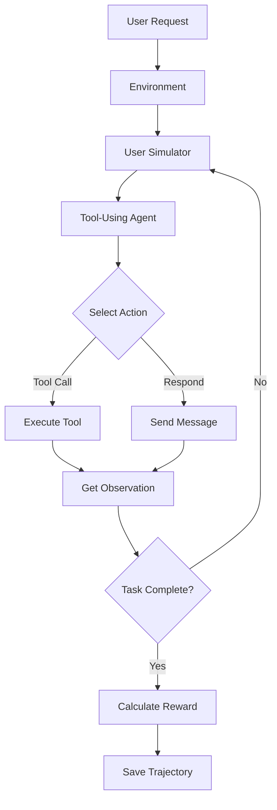

# τ-Bench CSE598 Project Documentation

## Project Overview

This project implements and evaluates tool-using conversational agents using the **τ-bench (tau-bench)** benchmark framework. The framework simulates realistic user scenarios in two domains: **airline** and **retail**, where agents interact with simulated users and apply domain-specific tool APIs and policy rules to complete tasks.

---

## ✅ Confirmation: vLLM is Being Used

**YES, this project uses vLLM** (not VLM/Vision Language Models). 

### What is vLLM?

**vLLM** is a high-performance inference server for Large Language Models (LLMs). It provides:
- Fast inference for open-source models
- OpenAI-compatible API
- Efficient memory management
- Support for various model architectures (Qwen, Llama, Mistral, etc.)

### How vLLM is Implemented in This Project

The project has dedicated vLLM support in the codebase:

1. **vLLM Chat Model**: `tau_bench/model_utils/model/vllm_chat.py`
   - Implements `VLLMChatModel` class
   - Uses OpenAI client to connect to vLLM server
   - Supports Qwen2 models (0.5B, 1.5B, 7B, 72B)
   - Supports Llama 3.1 models (8B, 70B)
   - Supports Mistral models

2. **vLLM Completion Model**: `tau_bench/model_utils/model/vllm_completion.py`
   - Implements `VLLMCompletionModel` class for completion-based inference
   - Similar model support as chat model

3. **Platform Support**: In `tau_bench/model_utils/model/model.py`
   ```python
   VLLM_CHAT = "vllm-chat"
   VLLM_COMPLETION = "vllm-completion"
   ```

4. **Model Factory**: In `tau_bench/model_utils/model/general_model.py`
   - Lines 171-181: Creates vLLM chat models
   - Lines 183-187: Creates vLLM completion models
   - Requires `base_url` parameter pointing to vLLM server

### Supported Qwen Models in vLLM

The project has built-in configurations for Qwen models:

| Model | Context Length | Capability Score |
|-------|---------------|------------------|
| Qwen/Qwen2-0.5B-Instruct | 32,768 | 0.05 |
| Qwen/Qwen2-1.5B-Instruct | 32,768 | 0.07 |
| Qwen/Qwen2-7B-Instruct | 131,072 | 0.2 |
| Qwen/Qwen2-72B-Instruct | 131,072 | 0.4 |

**Note**: The project requirement asks for Qwen3 models (4B, 8B, 14B, 32B), but the codebase currently has Qwen2 configurations. You'll need to update these or add Qwen3 configurations.

---

## Project Goals

By the end of this project, students will:

1. ✅ Explain how tool-using agents operate in realistic simulated conversations with APIs and policy constraints
2. ✅ Run τ-Bench experiments using standard baselines (ReAct, Function Calling, ACT) with multiple LLM configurations
3. ✅ Evaluate agent reliability using repeated-trial metrics (e.g., pass^k) and interpret results
4. ✅ Diagnose errors with structured taxonomy and produce plots highlighting performance differences
5. ✅ Develop, test, and justify an improved agent (or multi-agent) method that exceeds baseline performance

---

## Phase 1: Benchmark Setup + Baseline Results

### Requirements

**Submission Items**:
1. **Document**: Short write-up describing:
   - Setup (models, domains, key configs)
   - Individual contribution
   - Results table of pass^k for each baseline × model size (k=1 to 5)
   - Screenshot of results in terminal with username
2. **JSON files**: Trajectory files for each case

### Models Configuration

#### 1. User Agent (Fixed Throughout Project)

**Options**:
- Open-source: Qwen3-32B (via vLLM)
- Closed-source: GPT-4o, Gemini, or Claude family

⚠️ **IMPORTANT**: Keep the user agent fixed for the entire project. Changing it would make results incomparable.

**Current Configuration**:
```bash
# Check .env file - you have:
OPENAI_API_KEY=sk-...  # For GPT models
OPENROUTER_API_KEY=sk-or-v1-...  # For Qwen via OpenRouter
DASHSCOPE_API_KEY=sk-b64294b95d6f...  # For Qwen via Alibaba
```

#### 2. Tool Calling Agent (Variable Across Experiments)

**Required Model Sizes** (Qwen3 family):
- Qwen3-4B
- Qwen3-8B
- Qwen3-14B
- Qwen3-32B

**Note**: Project requires **Qwen3** models, but codebase has **Qwen2** configs. You may need to:
- Add Qwen3 configurations to `vllm_chat.py` and `vllm_completion.py`
- OR use Qwen2 models and justify in your report
- OR use OpenRouter/DashScope APIs which support newer models

---

## Baseline Methods

### 1. ReAct (Reason + Act)

**Description**: Agent alternates between reasoning about the problem and taking actions. After each action, it uses new observations to update its next step.

**Pattern**:
```
Thought: [Agent's reasoning]
Action: [Tool call or response]
Observation: [Result from environment]
Thought: [Next reasoning step]
...
```

**Implementation**: `tau_bench/agents/chat_react_agent.py`
- Uses `ChatReActAgent` class with `use_reasoning=True`

**Reference**: https://www.promptingguide.ai/techniques/react

**Example Command**:
```bash
python run.py \
  --agent-strategy react \
  --env retail \
  --model qwen/qwen-2.5-32b-instruct \
  --model-provider openrouter \
  --user-model gpt-4o \
  --user-model-provider openai \
  --num-trials 5 \
  --max-concurrency 10
```

### 2. ACT (Action-Centric)

**Description**: Agent focuses on selecting the next best action (tool calls) with minimal explicit reasoning shown. Emphasizes efficient action sequencing and state tracking.

**Pattern**:
```
Action: [Direct tool call]
Observation: [Result]
Action: [Next direct tool call]
...
```

**Implementation**: `tau_bench/agents/chat_react_agent.py`
- Uses `ChatReActAgent` class with `use_reasoning=False`

**Example Command**:
```bash
python run.py \
  --agent-strategy act \
  --env retail \
  --model qwen/qwen-2.5-32b-instruct \
  --model-provider openrouter \
  --user-model gpt-4o \
  --user-model-provider openai \
  --num-trials 5 \
  --max-concurrency 10
```

### 3. Function Calling (FC/Tool-Calling)

**Description**: Agent uses structured function/tool calls with explicit schemas (name + arguments). Improves reliability by constraining outputs.

**Pattern**:
```json
{
  "tool_calls": [{
    "function": {
      "name": "search_order",
      "arguments": "{\"order_id\": \"12345\"}"
    }
  }]
}
```

**Implementation**: `tau_bench/agents/tool_calling_agent.py`
- Uses `ToolCallingAgent` class
- Leverages LiteLLM's native tool calling support

**Reference**: https://platform.openai.com/docs/guides/function-calling

**Example Command**:
```bash
python run.py \
  --agent-strategy tool-calling \
  --env retail \
  --model qwen/qwen-2.5-32b-instruct \
  --model-provider openrouter \
  --user-model gpt-4o \
  --user-model-provider openai \
  --num-trials 5 \
  --max-concurrency 10
```

---

## Technical Architecture

### Key Components

1. **Environment** (`tau_bench/envs/`)
   - Simulates airline and retail scenarios
   - Manages user interactions
   - Provides tool APIs and policy rules

2. **Agents** (`tau_bench/agents/`)
   - `base.py`: Base agent interface
   - `tool_calling_agent.py`: Function calling implementation
   - `chat_react_agent.py`: ReAct and ACT implementations
   - `few_shot_agent.py`: Few-shot learning agent

3. **Model Utilities** (`tau_bench/model_utils/`)
   - **LiteLLM Integration**: Unified API for multiple providers
   - **vLLM Support**: For local open-source models
   - **Provider-specific clients**: OpenAI, Anthropic, Mistral, etc.

4. **Types** (`tau_bench/types.py`)
   - `RunConfig`: Configuration for experiments
   - `Action`, `Task`, `RewardResult`: Core data structures
   - `EnvRunResult`: Results from task execution

### How It Works



---

## Running Experiments

### Setup vLLM Server (for Open-Source Models)

If using Qwen models via local vLLM:

```bash
# Install vLLM
pip install vllm

# Start vLLM server with Qwen model
vllm serve Qwen/Qwen2.5-32B-Instruct \
  --host 0.0.0.0 \
  --port 8000 \
  --api-key sk-no-key-required

# In another terminal, run τ-bench
python run.py \
  --agent-strategy tool-calling \
  --env retail \
  --model Qwen/Qwen2.5-32B-Instruct \
  --model-provider vllm-chat \
  --model-base-url http://localhost:8000/v1 \
  --user-model gpt-4o \
  --user-model-provider openai \
  --num-trials 5
```

### Using OpenRouter (Easier Alternative)

OpenRouter provides hosted access to Qwen models without running vLLM:

```bash
# Add to .env
OPENROUTER_API_KEY=sk-or-v1-...

# Run experiment
python run.py \
  --agent-strategy tool-calling \
  --env retail \
  --model qwen/qwen-2.5-32b-instruct \
  --model-provider openrouter \
  --user-model gpt-4o \
  --user-model-provider openai \
  --num-trials 5 \
  --max-concurrency 10
```

### Complete Experimental Matrix

For Phase 1, you need to run:

**Domains**: 2 (retail, airline)
**Baselines**: 3 (ReAct, ACT, Function Calling)
**Model Sizes**: 4 (Qwen3-4B, 8B, 14B, 32B)
**Trials**: 5 (for pass^1 through pass^5)

**Total Experiments**: 2 × 3 × 4 = 24 configurations × 5 trials each

### Example Batch Script

```bash
#!/bin/bash

ENVS=("retail" "airline")
STRATEGIES=("react" "act" "tool-calling")
MODELS=(
  "qwen/qwen-2.5-4b-instruct"
  "qwen/qwen-2.5-7b-instruct"
  "qwen/qwen-2.5-14b-instruct"
  "qwen/qwen-2.5-32b-instruct"
)

for env in "${ENVS[@]}"; do
  for strategy in "${STRATEGIES[@]}"; do
    for model in "${MODELS[@]}"; do
      echo "Running: $env | $strategy | $model"
      python run.py \
        --agent-strategy $strategy \
        --env $env \
        --model $model \
        --model-provider openrouter \
        --user-model gpt-4o \
        --user-model-provider openai \
        --num-trials 5 \
        --max-concurrency 10 \
        --log-dir results
    done
  done
done
```

---

## Evaluation Metrics

### Pass^k Metric

The benchmark uses **pass^k** to measure success reliability over multiple trials.

**Definition**:
- pass^1: Success rate on first attempt
- pass^2: Probability of success in at least 1 of 2 trials
- pass^k: Probability of success in at least 1 of k trials

**Formula** (from paper):
```
pass^k = (1/N) × Σ[i=1 to N] (C(c_i, k) / C(n, k))
```

Where:
- N = number of tasks
- c_i = number of successful trials for task i
- n = total number of trials
- C(a,b) = binomial coefficient "a choose b"

**Implementation**: See `display_metrics()` in `tau_bench/run.py` (lines 180-203)

### Interpreting Results

**Example Output**:
```
🏆 Average reward: 0.65
📈 Pass^k
  k=1: 0.604
  k=2: 0.721
  k=3: 0.789
  k=4: 0.831
  k=5: 0.862
```

**Analysis**:
- Higher pass^k values indicate more reliable agents
- Gap between pass^1 and pass^5 shows consistency
- Compare across baselines and model sizes

---

## Environment Variables

Your `.env` file should contain:

```bash
# OpenAI (for user simulator - gpt-4o recommended)
OPENAI_API_KEY=sk-...

# OpenRouter (for Qwen models - easiest option)
OPENROUTER_API_KEY=sk-or-v1-...

# DashScope (alternative for Qwen models via Alibaba)
DASHSCOPE_API_KEY=sk-...

# Anthropic (optional - if using Claude as user)
ANTHROPIC_API_KEY=sk-ant-...

# Google (optional - if using Gemini)
GOOGLE_API_KEY=...

# Mistral (optional)
MISTRAL_API_KEY=...
```

---

## File Structure

```
tau-bench_CSE598/
├── .env                          # API keys (DO NOT COMMIT)
├── run.py                        # Main entry point
├── setup.py                      # Package installation
├── README.md                     # Original τ-bench docs
├── results/                      # Experiment results (JSON)
├── historical_trajectories/      # Pre-run trajectories
├── few_shot_data/               # Few-shot examples
├── tau_bench/
│   ├── __init__.py
│   ├── types.py                 # Data structures
│   ├── run.py                   # Core experiment logic
│   ├── agents/
│   │   ├── base.py              # Agent interface
│   │   ├── tool_calling_agent.py    # Function calling
│   │   ├── chat_react_agent.py      # ReAct & ACT
│   │   └── few_shot_agent.py        # Few-shot learning
│   ├── envs/
│   │   ├── base.py              # Environment interface
│   │   ├── retail/              # Retail domain
│   │   ├── airline/             # Airline domain
│   │   └── user.py              # User simulator
│   └── model_utils/
│       ├── model/
│       │   ├── vllm_chat.py         # vLLM chat model
│       │   ├── vllm_completion.py   # vLLM completion
│       │   ├── openai.py            # OpenAI models
│       │   ├── claude.py            # Anthropic Claude
│       │   └── general_model.py     # Model factory
│       └── api/                     # API utilities
```

---

## Common Issues & Solutions

### Issue 1: Qwen3 vs Qwen2

**Problem**: Project requires Qwen3 (4B, 8B, 14B, 32B) but code has Qwen2 configs.

**Solutions**:
1. Use OpenRouter with Qwen 2.5 models (closest to Qwen3)
2. Add Qwen3 configurations to `vllm_chat.py`
3. Document the substitution in your report

### Issue 2: vLLM Server Not Running

**Problem**: `Connection refused` when using vLLM provider.

**Solution**:
```bash
# Start vLLM server first
vllm serve Qwen/Qwen2.5-32B-Instruct --port 8000

# Then run τ-bench
python run.py --model-base-url http://localhost:8000/v1 ...
```

### Issue 3: Rate Limiting

**Problem**: Too many API requests to OpenAI/OpenRouter.

**Solutions**:
1. Reduce `--max-concurrency` (try 1-5)
2. Add delays between requests
3. Use different API keys for user vs agent

### Issue 4: Out of Memory (vLLM)

**Problem**: GPU runs out of memory.

**Solutions**:
1. Use smaller models (4B or 8B instead of 32B)
2. Reduce `--gpu-memory-utilization` in vLLM
3. Use quantized models (e.g., AWQ, GPTQ)

---

## Model Provider Options

### 1. vLLM (Local Hosting)

**Pros**:
- Full control over inference
- No API costs after setup
- Fast inference with optimization

**Cons**:
- Requires GPU with sufficient VRAM
- More complex setup
- Need to manage server

**Setup**:
```bash
pip install vllm
vllm serve MODEL_NAME --port 8000
```

### 2. OpenRouter (Recommended)

**Pros**:
- Easy to use (just API key)
- Supports many models including Qwen
- Pay-per-use pricing

**Cons**:
- Costs money
- Subject to rate limits
- Requires internet

**Setup**:
```bash
# Just add to .env
OPENROUTER_API_KEY=sk-or-v1-...
```

### 3. DashScope (Alibaba)

**Pros**:
- Official Qwen provider
- Good for Chinese language tasks

**Cons**:
- May have geographic restrictions
- Different API format

**Setup**:
```bash
# Add to .env
DASHSCOPE_API_KEY=sk-...
```

---

## Next Steps for Your Project

### Phase 1 Checklist

- [ ] Set up environment and install dependencies
- [ ] Configure API keys in `.env`
- [ ] Choose user model (e.g., gpt-4o) and keep it fixed
- [ ] Decide on model provider for tool-calling agent (OpenRouter recommended)
- [ ] Create batch script to run all experiments
- [ ] Run baseline experiments (3 strategies × 4 model sizes × 2 domains × 5 trials)
- [ ] Collect results in `results/` directory
- [ ] Calculate pass^k metrics (k=1 to 5)
- [ ] Create results table
- [ ] Take screenshot with username
- [ ] Write up setup documentation
- [ ] Document individual contributions
- [ ] Save trajectory JSON files
- [ ] Submit all required materials

### Recommended Execution Plan

**Week 1**: Setup and single experiment
- Install τ-bench
- Configure API keys
- Run one complete experiment to verify setup
- Document any issues

**Week 2**: Full baseline experiments
- Run all 24 configurations (3 strategies × 4 sizes × 2 domains)
- Monitor for errors
- Collect all trajectories

**Week 3**: Analysis and documentation
- Calculate metrics
- Create tables and plots
- Write documentation
- Prepare submission

---

## Key References

1. **τ-bench Paper**: https://arxiv.org/abs/2406.12045
2. **τ²-bench Extension**: https://arxiv.org/abs/2506.07982
3. **ReAct Paper**: https://arxiv.org/abs/2210.03629
4. **Function Calling Guide**: https://platform.openai.com/docs/guides/function-calling
5. **vLLM Documentation**: https://docs.vllm.ai/
6. **LiteLLM Docs**: https://docs.litellm.ai/

---

## Quick Start Commands

### Test Single Experiment

```bash
# Retail domain, Function Calling, Qwen-32B
python run.py \
  --agent-strategy tool-calling \
  --env retail \
  --model qwen/qwen-2.5-32b-instruct \
  --model-provider openrouter \
  --user-model gpt-4o \
  --user-model-provider openai \
  --num-trials 5 \
  --max-concurrency 5 \
  --task-ids 0 1 2 3 4
```

### Run Specific Task IDs

```bash
# Test on tasks 2, 4, 6 only
python run.py \
  --agent-strategy tool-calling \
  --env retail \
  --model qwen/qwen-2.5-32b-instruct \
  --model-provider openrouter \
  --user-model gpt-4o \
  --user-model-provider openai \
  --num-trials 5 \
  --task-ids 2 4 6
```

---

## Summary

✅ **Confirmed**: This project uses **vLLM** (inference server) for running open-source models like Qwen, Llama, and Mistral.

✅ **Implementation**: vLLM support is built into the codebase via `VLLMChatModel` and `VLLMCompletionModel` classes.

✅ **Alternative**: You can use **OpenRouter** as an easier alternative to self-hosting vLLM.

✅ **Phase 1 Goal**: Run baseline experiments (ReAct, ACT, Function Calling) across multiple Qwen model sizes and calculate pass^k metrics.

Good luck with your project! 🚀
